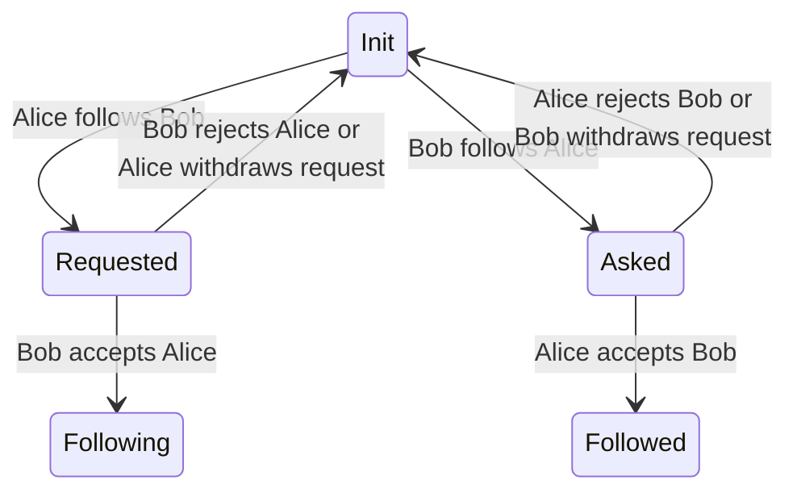
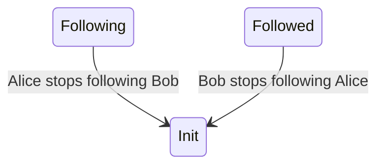
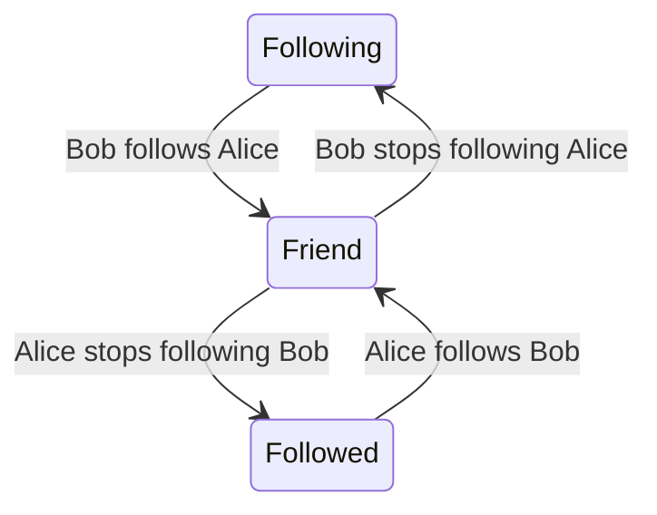
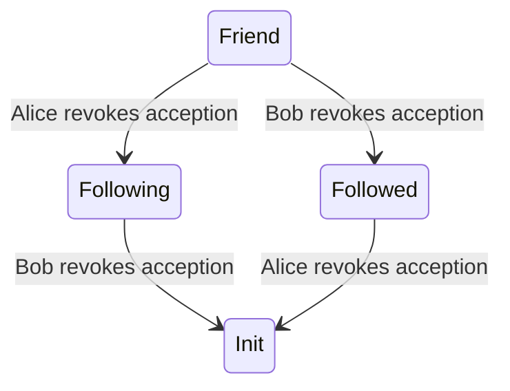
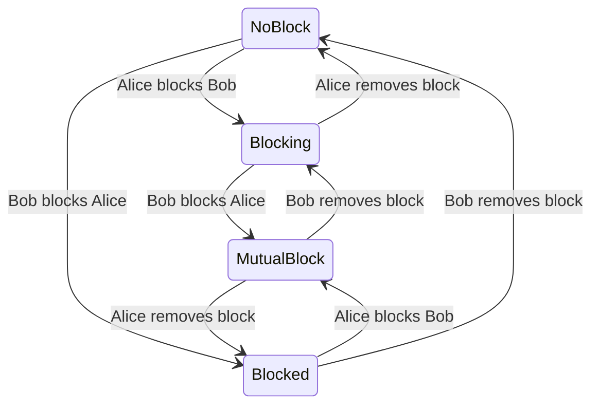

# Poor Man's Social Media

You are free to show this to anyone asking you to develop them the next Facebook for free. They deserve. (See [License](#license)).

> [!NOTE]
> I wrote this code nearly 10 years ago to learn PHP, made quick additions later. It doesn't reflect the development practices I follow today. I posted this because I can't post projects that I am working on for years. The good side is that I got enough spare time to containerize this XAMPP app, so only one command will get you it up and running.

> [!CAUTION]
> The "Poor Man's Social Media" project is a simple social media application developed as a learning exercise in PHP. It's not intended for production use or as a learning resource, given its outdated practices and security vulnerabilities.


## Features

-   Custom theme (login, hero, inputs, buttons)
-   Basic authentication with email-password
-   Passwords are hashed then stored
-   Enforcing password pattern rules on signup
-   Redirecting existing user to login form from signup
-   Posting photos
-   Deleting posts
-   Feed (without fan out. do not get fancy expectations)
-   Friendship feature (invite/accept/reject)
-   Blocking users
-   Infinite scroll for friend list
-   AJAX for some actions (No forms)
-   CSS bundling (without caching)
-   Redirecting unauthorized user to the original request after login (URLEncoding)

### Relationship State

Relationship between two users can be asymmetrical. And the state from both user's perspective stored separately.

There could be different methods to implement this:

-   Storing the state from perspective of user with smaller ID
-   Separating states that makes the diagram asymmetrical/directed into another table. Like waiting requests, follow status, friends. So, the asymmetrical states would exist only in presentation.

Worth to note that there is marginal benefit on having one state that represents all of the request state, follow state, mutuality and blocking state.

#### Follow requests

-   There are states which makes the relationship asymmetrical like `Followed` vs. `Following`.
-   In this relationship model, follows are subject to approval. Except when following a follower.

Below state diagram shows relationship status between Alice and Bob from Alice's perspective after each action.



#### Stop following



#### Friendship

-   Giving up on following a `Friend` ends up the friend becoming a follower. (Doesn't return to `Init`)
-   When two person follows each other they became friends.



#### Revoking acception

Revoking an follow acception is possible. Users can make people stop following them.



#### Blocking feature

-   Blocking someone drops follow approval.
-   Unblocking returns the state to the init.



## Requirements

-   Docker
-   font awesome (not included. download 4.6.3 and put `app/src/font-awesome-4.6.3/{css,fonts,less,scss}`)

## Run

```sh
make up
```

Then visit localhost:8080 on browser.

There are some user accounts already populated with data:

    1@localhost Loremipsum1
    2@localhost Loremipsum1
    3@localhost Loremipsum1
    ...
    25@localhost Loremipsum1

## Issues

-   Non standard project structure making it difficult to hire devs.
-   No load balancing, sharding or anything distributed. It won't scale.
-   Vulnurable to CSRF, SQL and XSS injections, directory traversal.
-   No type safety.
-   Doesn't have tests.
-   Errors that had to be kept internal are getting exposed to public.
-   No logging (more than apache does by default).
-   Some pages don't exist like password reset, changing profile photo, account settings.
-   DB schema designed for single DB server. It issues ordered integer IDs for rows which requires extra work to sync last issued number between servers.
-   Enums are hardcoded.
-   Implementation of relationship state is not the easiest alternative to maintain. Because of the number of edges and vertices making it hard to focus at once.

## License

Shared under terms of Apache2 license. See LICENSE file for details.

See LICENSE files in directories for redistributed work.
